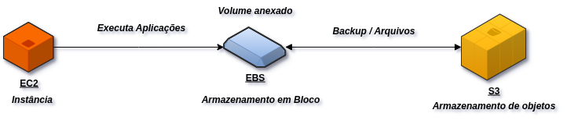

# ☁️ Desafio de Projeto - Gerenciando Instâncias EC2 na AWS

## 📌 Descrição
Este desafio teve como objetivo consolidar o conhecimento sobre **instâncias EC2** na AWS, explorando também a relação com **EBS** e **S3**.  

---

## 🚀 Passos Realizados
1. Criação da instância **EC2**  
2. Configuração de **Security Groups** para acesso seguro  
3. Conexão via **SSH**  
4. Associação de volume **EBS** à instância  
5. Integração com **S3** para armazenamento de objetos  
6. Encerramento e boas práticas de custo  

---

## 📊 Arquitetura do Projeto

---

## 💡 Insights Pessoais
- O **EBS** funciona como um HD persistente, independente do estado da instância.  
- Se não configurar, o EBS pode ser apagado ao terminar a EC2.  
- O **S3** é excelente para **logs, backups e dados acessíveis globalmente**.  
- **Security Groups** precisam de atenção: abrir só o necessário!  

---

## 📸 Evidências
As capturas de tela e diagramas estão na pasta [`/images`](./images).  

---

## 🔗 Recursos Úteis
- [AWS EC2 - Documentação Oficial](https://docs.aws.amazon.com/pt_br/ec2/)  
- [AWS EBS - Documentação Oficial](https://docs.aws.amazon.com/pt_br/ebs/)  
- [AWS S3 - Documentação Oficial](https://docs.aws.amazon.com/pt_br/s3/)  

---
